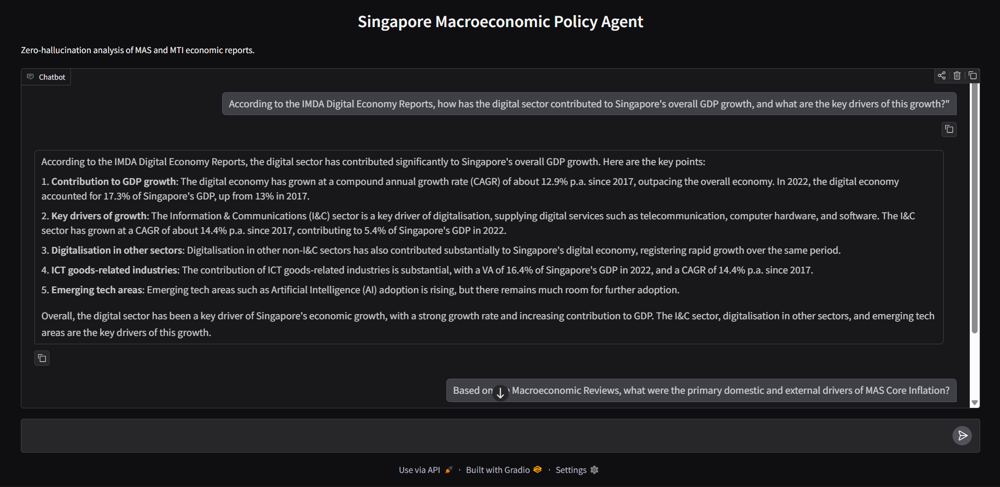

# SERI: Macroeconomic Policy RAG Agent




A fully local, zero-hallucination Retrieval-Augmented Generation (RAG) pipeline engineered to analyze decades of highly structured macroeconomic policy reports from the Monetary Authority of Singapore (MAS) and the Ministry of Trade and Industry (MTI).

Built as the qualitative engine for the **Singapore Economic Resilience Index (SERI)**, this project challenges the assumption that digital efficiency inherently drives economic stability. By parsing raw, unstructured policy text, the agent bridges the gap between theoretical economic indicators and deterministic data extraction.

This repository serves as a direct extension of the core SERI framework. While the primary index relies heavily on structured quantitative data (CSVs) to track economic metrics, this RAG agent was specifically engineered to unlock the qualitative context, policy rationale, and historical narratives buried within unstructured PDF reports. By providing a reliable platform to query text formats, it ensures that quantitative trends are always backed by explicit policy context.

## System Architecture
This pipeline avoids basic API wrappers in favor of an enterprise-grade, fully local memory framework designed to handle complex tabular and policy data spanning from 2005 to 2025:

1. **Automated Data Ingestion:** Extraction and semantic chunking of dense MAS/MTI PDFs using `pdfplumber` and LangChain's `RecursiveCharacterTextSplitter`.
2. **Local Vectorization:** Text chunks are embedded into a 384-dimensional mathematical space using Hugging Face (`sentence-transformers/all-MiniLM-L6-v2`) and persistently indexed on local storage via **FAISS**.
3. **LCEL Retrieval Chain:** A modern LangChain Expression Language (LCEL) pipeline retrieves the top-k ($k=4$) nearest-neighbor chunks using $L_2$ distance and pipes them into a tightly constrained context window.
4. **Zero-Hallucination Generation:** Powered by Meta's `Llama-3.1-8B-Instant` via the Groq API, operating at `temperature=0.0`. A strict guardrail prompt forces the model to reject queries ("Insufficient data...") rather than hallucinate external knowledge.
5. **Interactive UI:** A lightweight, stateless web interface built with **Gradio**.

## Quantitative Evaluation (LLM-as-a-Judge)
To mathematically prove the pipeline's reliability and safeguard against LLM hallucinations, this repository includes an automated evaluation framework (`src/evaluate.py`). 

Using a manually curated Ground Truth dataset of MAS/MTI facts, a secondary LLM pipeline scores the agent's outputs. 
* **Initial Benchmark:** Achieved an **80.0% Faithfulness Score**. 
* **Key Finding:** The evaluation loop successfully proved that while semantic vector search is highly accurate for qualitative policy synthesis, it is mathematically brittle for isolated numerical lookups. This empirical finding establishes the roadmap for a dual-agent architecture (adding a dedicated CSV/Pandas agent for quantitative data).

## Limitations & Compute Constraints
It is important to note that this V1 prototype was engineered under strict zero-dollar budget constraints. To achieve this, the entire semantic embedding pipeline (`all-MiniLM-L6-v2` and the FAISS indexing) was executed locally on standard consumer hardware (CPU/Integrated Graphics) rather than dedicated cloud GPUs. 

Furthermore, the generation engine relies on the free-tier Groq API, which imposes strict token-per-minute rate limits. As a result, while the agent achieves high faithfulness on targeted queries, it cannot process massive, multi-document batch operations at once, nor does it possess the exhaustive reasoning capabilities of paid, frontier-class models (like GPT-4). It is a lightweight, optimized proof-of-concept prioritizing accuracy over scale.

## Tech Stack
* **Orchestration:** LangChain (v1.0+ native LCEL)
* **Vector Database:** FAISS (Facebook AI Similarity Search)
* **Embeddings:** Hugging Face 
* **LLM Compute:** Meta Llama 3.1 (via Groq API)
* **Frontend:** Gradio
* **Data Engineering:** Pandas, pdfplumber

## Quick Start & Installation

```bash
# Clone the repository
git clone [https://github.com/GreenOrange05/seri-rag-agent.git](https://github.com/GreenOrange05/seri-rag-agent.git)
cd seri-rag-agent

# Create and activate virtual environment
python -m venv venv
source venv/bin/activate  # On Windows use: venv\Scripts\activate

# Install dependencies
pip install -r requirements.txt

# Environment Setup
# Create a .env file in the root directory and add your key: 
# GROQ_API_KEY="your_api_key_here"

# Launch the Web Interface
python src/app.py
